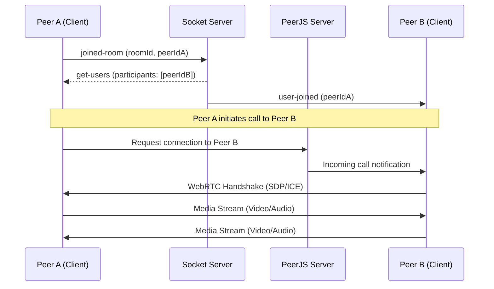
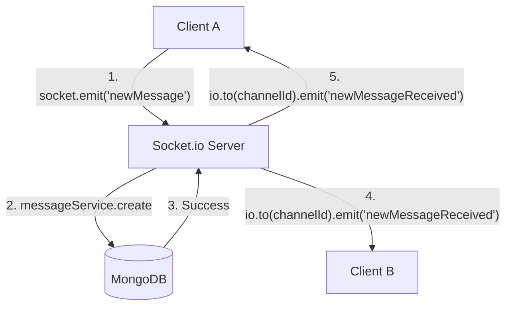
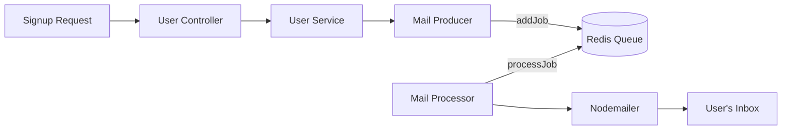

# Technical Documentation & FAQ

This document provides a deeper dive into the technical architecture of the Chat Application, specifically focusing on the recently integrated **Video Calling** feature and addressing common questions.

## 📹 Video Calling Implementation

The video calling feature is built using **WebRTC** for peer-to-peer media streaming, with **PeerJS** simplifying the connection logic and **Socket.io** handling the signaling process.

### Architecture Overview

1.  **Signaling**: Socket.io is used to exchange session descriptions (SDP) and candidate information between peers.
2.  **Peer Connection**: PeerJS manages the WebRTC `RTCPeerConnection` and handles the complexities of STUN/TURN servers.
3.  **Media Streams**: The browser's `navigator.mediaDevices.getUserMedia` API captures local video and audio.

### Signaling & Connection Flow



### Backend Details

-   **PeerJS Server**: Integrated directly into the Express server using `peer`.
    ```typescript
    const peerServer = ExpressPeerServer(server, {
      path: '/peerjs',
      allow_discovery: true,
    });
    app.use('/peerjs', peerServer);
    ```
-   **Room Management**: The `videoCallRoomController` maintains an in-memory store of active rooms and their participants.
    -   `create-room`: Initializes a new session.
    -   `joined-room`: Adds a peer to a room and notifies others.
    -   `ready`: Signals that a peer is prepared to receive calls.

### Frontend Details

-   **SocketContextProvider**: Initializes the PeerJS instance and handles incoming calls globally.
    -   It uses a `peerReducer` to manage the collection of remote streams.
    -   It ensures the local media stream is ready before answering incoming calls.
-   **VideoRoom Component**:
    -   Displays the local video feed and all remote participant feeds.
    -   Provides an "Invite Link" for other users to join the same workspace's video room.
    -   Uses `UserVideoFeedPlayer` (atom) to render individual media streams.

---

## 💬 Real-time Messaging Flow

The following diagram illustrates how a message travels from one client to another, ensuring persistence and real-time delivery.



---

## 📧 Background Email Queue (BullMQ)

The email verification system uses a producer-consumer pattern to ensure that the user registration process remains fast.



---

## ❓ Frequently Asked Questions (FAQ)

### 1. How do I start a video call?
Navigate to a workspace and click on the "Video Meeting" link (if implemented in the sidebar) or navigate directly to `/workspace/:workspaceId/videoRoom`. You can share the meeting URL with other members of the same workspace.

### 2. Why is my camera/microphone not working?
Ensure you have granted permission to the browser to access your camera and microphone. The application uses `getUserMedia`, which requires an `https` connection or `localhost` for security reasons.

### 3. Does this application support multiple participants in a video call?
Yes! The implementation supports multiple peers. Each new participant who joins the room will automatically attempt to call every other participant already in the room.

### 4. How are messages stored?
Messages are stored in **MongoDB**. When a message is sent via Socket.io, it is persisted to the database and then broadcasted to all other clients in the same channel.

### 5. What is the "Join Code" used for?
The Join Code is a unique identifier for a workspace. Instead of manually adding every user, you can share the Join Code. Users can then go to the "Join Workspace" page, enter the code, and be added as a member automatically.

### 6. Why do I need Redis?
Redis is used as the backend for **BullMQ**, which handles background tasks like sending email notifications. This ensures that the main API remains responsive even when sending many emails.

### 7. Can I upload files other than images?
Currently, the rich text editor supports image attachments via Cloudinary. Future updates may include support for other file types.

### 8. Is my data secure?
The application uses **JWT** (JSON Web Tokens) for authentication. All passwords are encrypted using **bcrypt** before being stored in the database.

### 9. How do I verify my email?
If email verification is enabled (`ENABLE_EMAIL_VERIFICATION=true`), you will receive a link in your email after signing up. Clicking this link will hit the `/verify/:token` endpoint and activate your account.

### 10. Can I host this myself?
Absolutely. Follow the installation and environment variable setup instructions in the `README.md`. You will need instances of MongoDB and Redis running.
